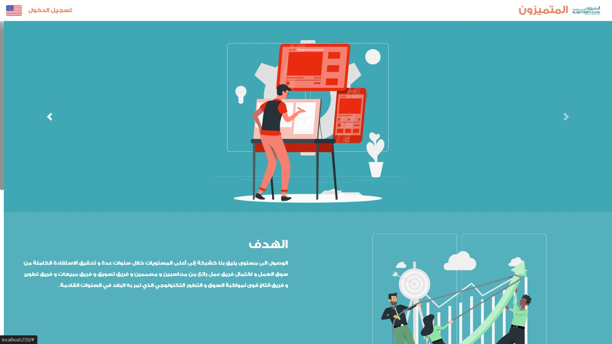
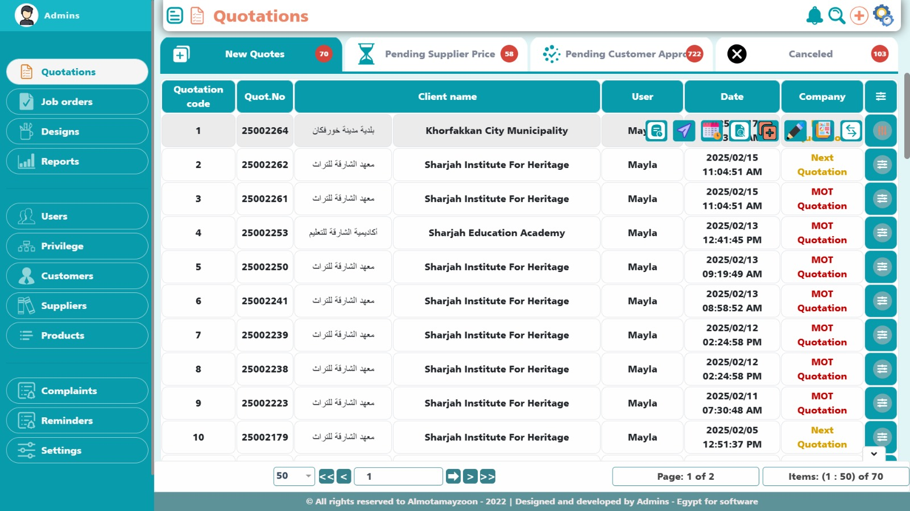
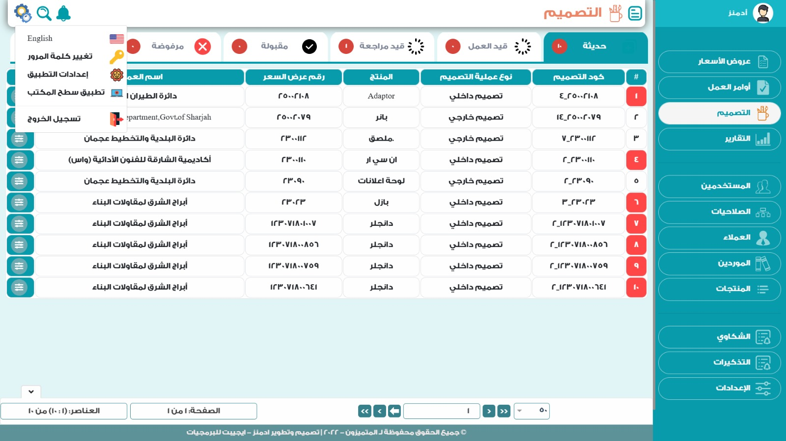
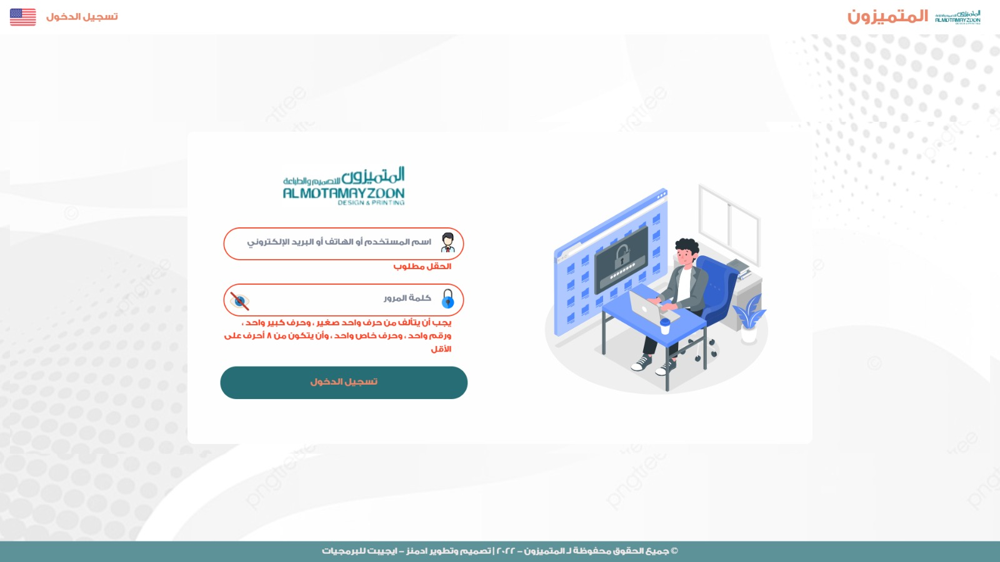

<h1 align="center">AMS-DEV1.1 ( WEB - Vue.Js ) </h1>
<p align="center">
  
  
  
  
</p>

---

## Features:

  #### User-friendly interface for Advertising Management System

  #### Real-time data visualization with Chart.js

  #### Responsive design for all devices

  #### Secure authentication and authorization

  #### Integration with API for backend services

  #### Multi-language support with vue-i18n

  #### File management with vue-file-agent

  #### Calendar integration with v-calendar

## Technologies Used:

  #### Vue.js

  #### Node.js

  #### Chart.js

  #### Firebase

  #### Bootstrap & Bootstrap-Vue

  #### Axios

  #### ESLint for code linting

  #### Babel for JavaScript compilation

<p align="center">
  
</p>

- ### System code: `(AMS)`

- ### System name: `(Advertising Management System)`

- ### Platform: `(WEB)`

- ### Programming Language: `(Vue.JS)`

- ### Project name: `(DEV1.1)`

- ### Target group type: `(All Users)`

---

## Project setup

```
npm install
```

### Compiles and hot-reloads for development

```
npm run serve
```

### Compiles and minifies for production

```
npm run build
```

### Run your unit tests

```
npm run test:unit
```

### Lints and fixes files

```
npm run lint
```

### Customize configuration

See [Configuration Reference](https://cli.vuejs.org/config/).

---

### GitHub

```
git add .
```

```
git commit -m 'your message'
```

```
git push origin branch-name
```

---

## Chart.js

#### To run Chart.js

1. Find in "node_modules/vue-chartjs/es/BaseCharts.js"

```
import Chart from 'chart.js';
```

2. Replace it by

```
import Chart from 'chart.js/auto';
```
---


